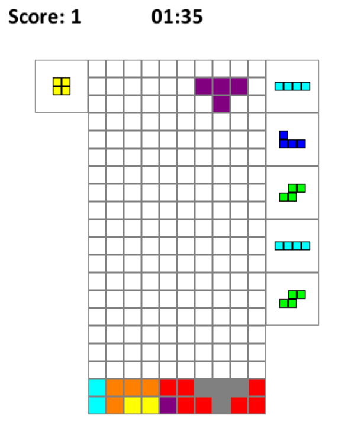

# Tetris

A simple tetris game that aims to restore the classic Tetris Battle gameplay



## Installation and Running

1. Install the environment:

```bash
conda create -f environment.yaml
conda activate tetris
```

2. Run tetris.py

```bash
python tetris.py
```

## Gameplay

The game is controlled using the following keyboard controls:

- **Move left**: Left arrow key
- **Move right**: Right arrow key
- **Move down**: Down arrow key
- **Rotate clockwise**: Up arrow key
- **Rotate counterclockwise**: Right Ctrl key
- **Hold**: Right Shift key
